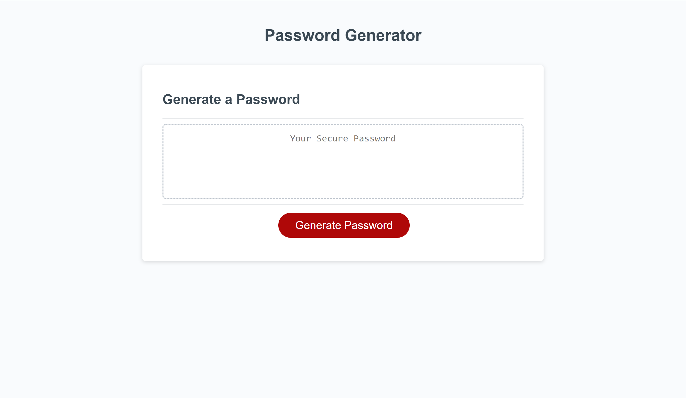

# Password Generator

## Push the big, red "Generate Password" button to get started!

## Once pressed...

1. You will set a length for your desired password (between 8 and 128 characters)
2. You will be prompted for desired password criteria (lowercase, uppercase, numbers, and special characters). Confirm or cancel the prompt to continue.
3. If no criteria are selected, no password will be generated!
4. Enjoy your new password! It will appear inside the box saying "Your Secure Password."

* Each step is logged in the console